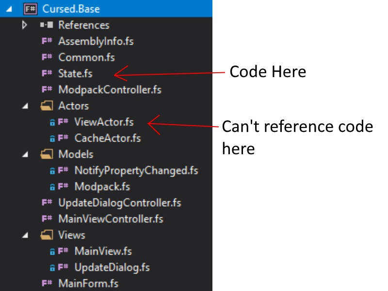
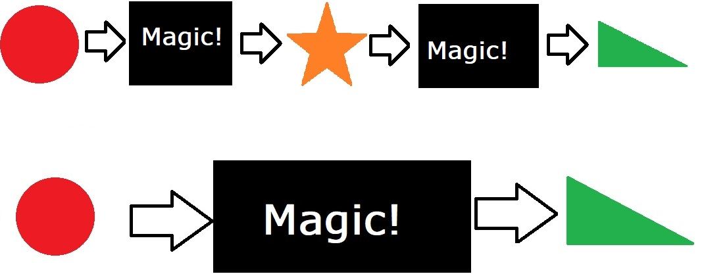

- title : Functional Programming with F#
- description : A primer to the world of Functional Programming with F#
- author : Kai Ito
- theme : night
- transition : default

***

    

## A primer to the world of Functional Programming with F#

   

* Kai Ito
* https://www.xing.com/profile/Kai_Ito/
* https://github.com/kaeedo/IntroductionToFunctionalProgramming

' Who here has any prior experience with F#/Functional programming

***

### What is Functional Programming

* Function Composition over Inheritance
* Expressions over Statements
* Immutability
* Use of higher-order functions
* Use of pure functions

---

### Benefits of the Functional paradigm

* Higher order functions
  * High level abstractions
  * Code reusability
* Pure Functions
  * Easier to reason about
  * Easier to test
  * Easier to debug
* Immutability
  * Less bugs
  * No invalid state
  * Thread safety
* "If it compiles, it works"
* "Pit of Success"

---

' The ball is your project and its architecture
' The top of the mountain is a successful project
' Takes a lot of hard work and discipline
' However, the moment you or someone else on the team makes a mistake, all that hard work is undone
' For example, making a database call directly from a Domain Model, instead of going through predefined services and other abstractions

---

' This time, success is at the bottom of the pit
' That doesn't mean that success is bad, simply that gravity helps you get there
' What that means in practice, is that the F# type system and compiler help you get there
' And once your in that pit, it's much easier to stay successful, as trying to get out now takes more effort
' It's much more difficult to make mistakes, or to ignore established patterns and abstractions, because the compiler enforces them

***

### What is F#

* Functional first, multi-paradigm language
* Runs on .Net (and Mono, Xamarin, .Net Core)
* First released in 2005 by Microsoft Research
* Now belongs to The F# Software Foundation
* Open Source

---

### Syntax in a nutshell

* ML syntax
* Type inference
* Whitespace significant
* Expression-based
* Immutable by default

 

    [lang=fsharp]
    let thisIsAnInt = 1
    let thisIsAString = "This is a string"
    let optionalTypeAnnotation: bool = true

    let listOfInts = [ 1; 2; 3 ]
    let listOfStrings =
        [ "www.zuehlke.com"
          "www.google.com"
          "www.microsoft.com" ]

' let declarations are called values instead of variables

---

### Functions

* First class functions
* Last expression is the return "statement"

 

    [lang=fsharp]
    let add a b =
        a + b

    let sign num =
        if num > 0 then "positive"
        elif num < 0 then "negative"
        else "zero"

    let rec fib n =
        match n with
        | 1 -> 1
        | 2 -> 1
        | n -> fib(n-1) + fib(n-2)

---

### Piping

 

    [lang=fsharp]
    let printer f = printfn "Number is: %f" f

    [0.0..100.0]
    |> List.filter (fun i -> i % 2.0 = 0.0)
    |> List.map (fun i -> i ** 2.0)
    |> List.iter printer

    let (|>) value fn =
        fn value

---

### Records

* Simple aggregates of data
* Can be struct or reference types
* Has structural equality

 

    [lang=fsharp]
    type User =
        { FirstName: string
          LastName: string
          Age: int }

    let kai = { FirstName = "Kai"; LastName = "Ito"; Age = 27 }
    let cloneOfKai = { FirstName = "Kai"; LastName = "Ito"; Age = 27 }

    printfn "%b" (kai = cloneOfKai) // true

    let olderKai = { kai with Age = kai.Age + 1 }

    printfn "%i" (olderKai.Age) // 28
    printfn "%i" (kai.Age) // 27

---

### Discriminated Unions

* More powerful enum
* Data point that can have multiple different types

 

    [lang=fsharp]
    type Shape =
    | Rectangle of width: float * length: float
    | Circle of radius: float
    | Triangle of float * float * float

    let rectangle: Shape = Rectangle (2.0, 5.0)
    let circle: Shape = Circle 2.5
    let triangle: Shape = Triangle (6.1, 2.0, 3.7)

    let whichShape shape =
        match shape with
        | Rectangle (width, length) ->
            printfn "Rectangle with sides %f %f" width length
        | Circle radius ->
            printfn "Circle with radius %f" radius
        | Triangle (side1, side2, side3) ->
            printfn "Triangle with sides %f %f %f" side1 side2 side3

***

### Benefits of the F# type system

* No null
* Make illegal states unrepresentable
* Use types to represent the domain
* Types can also be used to encode business logic
* Files and code must be in dependency order

' File and code cannot use forward reference. What this means is that code can only reference values and functions written above it. This means the order of files are important.
' This may seem really strange at first, but as you get used to this quirk, you quickly learn to appreciate this organization as it becomes incredibly easy to read large projects

---

### The Option type

    [lang=fsharp]
    type Option<'a> =
    | Some of 'a
    | None

    let validInt: int option = Some 1
    let invalidInt: int option = None

    let numbers = [ 1; 2; 3; 4; ]
    let foundNumber = numbers |> List.tryFind (fun x -> x = 4)
    let missingNumber = numbers |> List.tryFind (fun x -> x = 50)

    printfn "The number is: %i" foundNumber
    // Compile Error: Type mismatch: Expecting "int" but got "int option"

    let printInt input =
        match input with
        | Some i -> printfn "The number is: %i" i
        | None -> printfn "Didn't find number"

    printInt foundNumber // The number is: 4
    printInt missingNumber // Didn't find number

' This is how a lack of value is represented
' Many standard library and 3rd party libraries use the Option type as a return value
' Why is this useful?
' The compiler forces you to handle both cases
' Forces you to think about what happens when you get an unexpected result

---

### Making illegal state unrepresentable
* Imagine business logic where a User either needs an email address or phone number or both
* Required to have at least one of them

    [lang=fsharp]
    type ContactUser = { Username: string; Email: string option; PhoneNumber: string option }

    let createUser username emailAddress phoneNumber =
        // Logic to assign either email address or phone or both
        // Error prone

        { Username = "kaiito"; Email = "kai.ito@zuehlke.com"; PhoneNumber = "089 555 1234" }

---

### F# Type System to the rescue
    [lang=fsharp]
    type ContactInformation =
    | Email of string
    | PhoneNumber of string
    | EmailAndPhone of string * string

    type SafeContactUser = { Username: string; Contact: ContactInformation }

    let email = Email "kai.ito@zuehlke.com"
    let phoneNumber = PhoneNumber "089 555 1234"
    let emailAndPhone = EmailAndPhone ("kai.ito@zuehlke.com", "089 555 1234")

    let user1 = { Username = "kaiito1"; Contact = email }
    let user2 = { Username = "kaiito2"; Contact = phoneNumber }
    let user3 = { Username = "kaiito3"; Contact = emailAndPhone }

    let user4 = { Username = "kaiito4"; Contact = null } // Compiler Error
    let user5 = { Username = "kaiito5"; Contact = "someString" } // Compiler Error

' When deconstructing the Contact information, automatically know what kind of contact information it is

' Assumes happy path
' Validation has been done elsewhere
' Goes along with pit of success

---

### Dependency Order

' Code in State.fs can't reference any code declared in any of the files below it.
' This allows for architectural constructs, such as the Onion model, to be type checked by the compiler
' Can't accidentally call a database method from the Domain model which is supposed to be pure
' "Pit of Success" forced to do things the proper way

---

    [lang=fsharp]
    type Customer =
        | T1 of CustomerObserver

    type CustomerObserver =
        | T1 of Customer

    // Compiler error: The type 'Customer' is not defined

    type FirstType =
        | T1 of SecondType

    and SecondType =
        | T1 of FirstType

***

### Function Composition
* Compose multiple functions into one function
* Code reusability without verbosity

---

---

---

    [lang=fsharp]
    let parseDateTime (dateTime: string) = System.DateTime.Parse(dateTime)
    let getYear (date: System.DateTime) = date.Year

    let date = parseDateTime "13-03-2018 12:00am"
    let currentYear: int = getYear date

    printfn "The current year is: %i" currentYear
    // The current year is: 2018

    let composedGetYear: string -> int = parseDateTime >> getYear
    let yearFromComposed: int = composedGetYear "13-03-2018 12:00am"

    printfn "The current year from composed function is: %i" yearFromComposed
    // The current year from composed function is: 2018

' Before I get into a use case for function composition, I'd like to take a look at function currying first

***

### Function Currying and Partial Function Application
* Creating new functions by not supplying all parameters
* F# curries all functions by default
* What does `x: int -> y: int -> int` mean

---

### Curried function
    [lang=fsharp]
    let add x y =
        x + y

    [lang=fsharp]
    let add x =
        fun y ->
            x + y

    let threeParams firstName middleName lastName =
        printfn "Full name is: %O, %O, %O" firstName middleName lastName

    let threeParams firstName =
        fun middleName ->
            fun lastName ->
                printfn "Full name is: %O, %O, %O" firstName middleName lastName

' A curried function is a function created by only supplying a part of the parameters a function expects
' This essentially "binds" the given values to those parameters
' Works with any number of parameters

---

### Partial Function Application
* Using curried functions
* Only supply some of the parameters

    [lang=fsharp]
    let add x y =
        x + y

    let curriedAdd = add 3
    printfn "Result is: %i" (curriedAdd 5)
    // Result is: 8

    let double = (*) 2

    [1..10]
    |> List.map double
    // [2; 4; 6; 8; 10; 12; 14; 16; 18; 20]
---

### Point-free programming
* What happens when you abuse currying and partial function application
* Avoid explicitly specifying parameters
* Use Higher-order functions everywhere

    [lang=fsharp]
    let sum list = List.reduce (+) list
    let freeSum = List.reduce (+)

    let doubleAndIncrement x = x * 2 + 1
    let freeDoubleAndIncrement = (*) 2 >> (+) 1

' Both functions have same signature
' The first explicitly defines a parameter
' The second returns a function that requires a parameter

---

### Demo

' functionCurryingDemo.fsx
' You use a free monad which allows you to build a monad from any functor
' Dependency injection can be done via partial function application

***

### Railway Oriented Programming
* Error handling through function composition
* Clean control flow
* Treat errors as first class citizens

' Not just exceptions. Any errors, for example validation messages as well

---

### Problems with the Imperative approach

    [lang=csharp]
    public string UpdateAndSend(string input)
    {
        if (string.IsNullOrWhitespace(input))
            return "empty input"; // Or should we throw an Exception?

        try {
            var updatedUser = UpdateUserInDatabase(input);
            return ConvertToJson(updatedUser);
        }
        catch (DatabaseException e) {
            return "Problem updating user in DB"; // Or should we rethrow?
        }

        return "Failed to update and send"; // Or should we throw an Exception?
    }

' There's no unifying way to handle errors
' Sometimes it uses try catch, other times simple conditional statements
' Should we throw exceptions, or should we return different failure messages
' Forces caller to handle each failure case individually

---

' Let's take a look at our Red Circle to Yellow Star function from earlier
' What happens when some kind of error occurs?

---

' We can model our function like a railway switch
' We have our input, and we have a happy path, and a sad path
' The happy path can cause an error, but the error path can't go back to the happy path

---

' And just like real rail tracks, we can easily combine them
' But since we're combining functions, we can easily Compose them like we saw earlier
' However, now you might ask, what happens to the end of the error track. Where does that go?

---

' We can expand the input of our functions to take in an error as well
' As I mentioned a moment ago, once we are on an error path, we won't be going back to the happy path
' Reason being, we will no longer have valid input for the next part in our workflow, which would cause additional errors to occur

---

' We can now expand this model to compose as many functions as we want, creating an entire workflow

---

### Demo

' railwayOrientedDemo.fsx
' We partially apply the bind function
' Railway oriented programming can do much more, for example running multiple tracks in parallel
' or using single track functions, or having dead end tracks.
' The standard library already includes several helper methods, but there also exists several open source libraries for working with RoP, one such library is called Chessie

***

### Monads

* A monad is just a monoid in the category of endofunctors
* Chainable wrapper around a data structure that performs an extra operation after each expression
* Semicolon at end of statement performs extra action

---

### Monad in Detail
* A constructor that wraps a value: *the monadic value M*
* A bind function that accepts a function as its parameter
  * Applies this function to the internally wrapped value *M*
  * Returns the function’s output wrapped as a monad
* A return function that simply unwraps the monadic value

---

### F# Computation Expression
* NOT Monads
* Can be used to express monads

' Here is the async monad, or continuation monad
' Computation expressions can also be used to represent iterators, LINQ queries, or generators to name a few examples

    [lang=fsharp]
    let result =
        async {
            let! (username: string) = getByIdAsync 1
            let! (replies: string list) = getRepliesByUsernameAsync username

            let count = replies |> List.length

            return (replies, count)
        } |> Async.RunSynchronously

' The let bang calls the bind method on the builder, in this case the async builder
' Regular let works normally

---

### Demo

' Easier to understand with a demo
' Lets create a computation expression from scratch
' computationExpression.fsx

***

### Additional resources

* http://fsharp.org/learn.html
* https://fsharpforfunandprofit.com/
* http://www.tryfsharp.org/Learn/getting-started (Requires Silverlight...)
* https://kaeedo.github.com/IntroductionToFunctionalProgramming

***

### Thank you!

* Questions?
* Feedback?
